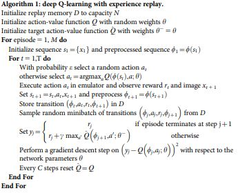
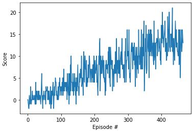

# Deep Reinforcment Learning @ UDACITY --> Project 1 "Navigation"

### 1. Learning Algorithm
To solve our "Navigation" task a Deep Q-Learning agent with experience replay is used.\
The algorithm is explained in the following picture out of the DQN Nature Paper "Human-level control through deep reinforcement learning" whereas the UNITY framework output gives us no picture but a reward r_t and a new state vector s_t+1

- At the beginning the replay memory, the action-value function Q ("qnetwork_local" @ dgn_agent) and the target action value function Q_top (qnetwork_target @ dgn_agent) are initialized
- Iterating through several episodes our agent try to maximize cumulative reward (due to a high GAMMA value the agent cares mainly for future rewards)
- state space and preprocessed sequences (batches of experiences out of the replay buffer) are initialized
- As long as the episodic task did not end, the agent selects an action with respect to the e-greedy policy and returns a reward, the new state vector s_t+1 and info if episode ends
- Next the agent stores the transition (state vectors, action, reward, done) in the replay buffer
- When enough samples are in the replay buffer (>BATCH_SIZE) and update step is reached @UPDATE_EVERY the agent will do an optimizer step with learning rate LR (by calculating the MSE loss between output of qnetwork_local and qnetwork_target) to update qnetwork_local (agent is learning)
- Additionaly the qnetwork_target get´s a soft update (θ_target = τ*θ_local + (1 - τ)*θ_target) were TAU represents the interpolation parameter
- If cummulative reward (score) is > 13.0 over 100 consecutive episodes the environment is succesfully solved and teh episodic task ends

Following Hyperparameters were used to train the agent (carry over from previous project "dqn")
- BUFFER_SIZE = int(1e5)  # replay buffer size
- BATCH_SIZE = 64         # minibatch size
- GAMMA = 0.99            # discount factor
- TAU = 0.001             # for soft update of target parameters
- LR = 0.0005             # learning rate 
- UPDATE_EVERY = 4        # how often to update the network
- LAYERS = 64             # depth of fully connected layers

To keep the model architecture lean and to bring not too much complexity in the non linear function approximator for the Q-table a simple neural network with the following architecture is used (carry over from previous project "dqn"). The hidden layer has dimension (LAYERS, LAYERS)
- __1__ fully connected __input layer__ with ReLu activation function 
- __1__ fully connected  __hidden layer__ with ReLu activation function 
- __1__ fully connected __output layer__

### 2. Plot rewards
Here you can see the progress of rewards the agent collects over several episodes.

Episode 100	Average Score: 0.92\
Episode 200	Average Score: 3.99\
Episode 300	Average Score: 6.98\
Episode 400	Average Score: 10.17\
Episode 500	Average Score: 12.55\
Episode 524	Average Score: 13.06\
Environment solved in 424 episodes!	Average Score: 13.06

### 3. Ideas for future Work
To imporve the agents learning performance the following can be done:
- a further detailled scan of the choosen hyperparameters
- implement 'Double DQN'
- implement 'Prioritized Experience Reply'
- implement 'Dueling DQN'
- implement 'Rainbow DQN'